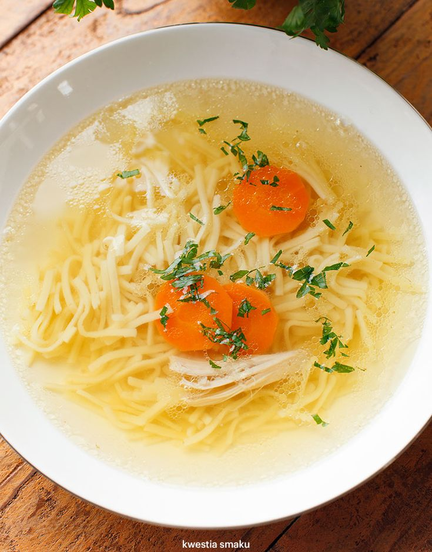

# Menu
## Dania klasyczne

|Lp. |Danie:                                                            |waga mięsa: |250 gram |300 gram |400 gram |
|----|------------------------------------------------------------------|------------|---------|---------|---------|
|1.  |Kotlet schabowy (schabowy, ziemniaczki, mizeria)                  |            |26 zł    |    -    |35 zł    |
|2.  |Devolay (devolay z serem, frytki, surówka)                        |            |32 zł    |    -    |40 zł    |
|3.  |Rolada śląska (rolada, kluski śląskie, surówka)                   |            |28 zł    |    -    |36 zł    | 
|4.  |Pieczeń (pieczeń wieprzowa, kasza, surówka)                       |            |23 zł    |25 zł    |28 zł    |
|5.  |Kotlet drobiowy (kotlet, ziemniaczki, surówka)                    |            |23 zł    |    -    |28 zł    |
|6.  |Karczek wp (karczek, kasza, surówka)                              |            |23 zł    |    -    |28 zł    |
|7.  |Kurczak grillowany (kurczak grillowany, frytki, mizeria)          |            |    -    |28 zł    |    -    |
|8.  |Stek z kurczaka (stek z kurczaka, frytki, mizeria)                |            |    -    |28 zł    |    -    |
|9.  |Jadło drwala (gulasz wieprzowy, placki ziemniaczane, surówka)     |            |    -    |    -    |32 zl    |

## Pierogi

|Lp. |Zupa:                                                             |Cena:       |
|----|------------------------------------------------------------------|------------|
|1.  |Pierogi ruskie                                                    |25 zł       |
|2.  |Pierogi z mięsem                                                  |25 zł       |
|3.  |Pierogi z serem                                                   |21 zł       |
|4.  |Pierogi ze szpinakiem                                             |22 zł       |
|5.  |Pierogi z jagodami                                                |25 zł       |
|6.  |Pierogi żytnie z kaszą                                            |26 zł       |

## Dania jednogarnkowe

|Lp. |Danie:                                                            |waga        |300 gram |400 gram |
|----|------------------------------------------------------------------|------------|---------|---------|
|1.  |Bigos (kapusta, kiełbasa, boczek, szuszone grzyby)                |            |20 zł    |25 zł    |
|2.  |Leczo (cebula, papryka, pieczarki, pietruszka)                    |            |18 zł    |23 zł    |
|3.  |Flaczki (flaki wołowe, bulion rosołwy)                            |            |16 zł    |21 zł    |

## Zupy

|Lp. |Zupa:                                                             |Cena:       |
|----|------------------------------------------------------------------|------------|
|1.  |Rosół z makaronem                                                 |15 zł       |
|2.  |Czosnkowa z grzankami                                             |18 zł       |
|3.  |Grzybowa z makaronem                                              |16 zł       |

## Dodatki
1. Frytki - 8 zł
2. Sos - 5 zł
3. Kluski Śląskie - 12 zł

## Napoje

1. Kompot - 3 zł
2. Coca-Cola - 8 zł
3. Sprite - 8 zł
4. Fanta - 8 zł
5. Woda gaz/ngaz - 7 zł
